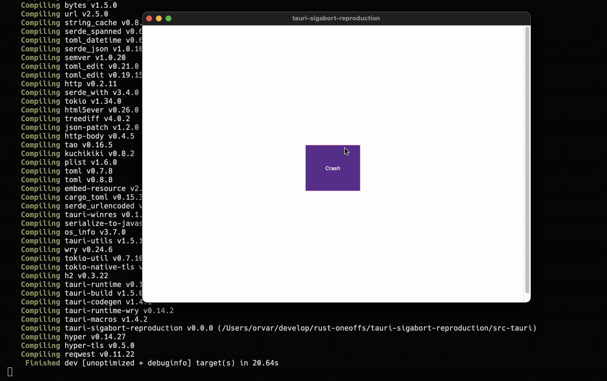

# Tauri SIGABRT/SIGSEGV reproduction

This is a reproduction of a hard crash that happens when using Tauri.

Crash prerequesites:

- Overwhelm event loop with messages
- `allowlist: all` in tauri config, or at least 5+ allowlisted actions. Somehow this affects how often it crashes.

## Reproduction recording



## Thread sanitizer output

<details><summary>CLICK: RC data race between two threads</summary>

```
==================
==================
WARNING: ThreadSanitizer: data race (pid=72588)
  Read of size 8 at 0x000108607388 by thread T25:
    #0 alloc::rc::RcInnerPtr::weak::h17a3384c68163163 <null>:114302128 (tauri-sigabort-reproduction:arm64+0x100539078)
    #1 _$LT$alloc..rc..Rc$LT$T$C$A$GT$$u20$as$u20$core..ops..drop..Drop$GT$::drop::h6af221c47ef4a1ee <null>:114302128 (tauri-sigabort-reproduction:arm64+0x10053bf2c)
    #2 core::ptr::drop_in_place$LT$alloc..rc..Rc$LT$std..sync..mutex..Mutex$LT$tao..global_shortcut..ShortcutManager$GT$$GT$$GT$::h10ffee69f7bd5083 <null>:114302128 (tauri-sigabort-reproduction:arm64+0x10064c724)
    #3 core::ptr::drop_in_place$LT$tauri_runtime_wry..DispatcherMainThreadContext$LT$tauri..EventLoopMessage$GT$$GT$::h85b3b639fa5b2412 <null>:114302128 (tauri-sigabort-reproduction:arm64+0x10066e3f4)
    #4 core::ptr::drop_in_place$LT$tauri_runtime_wry..Context$LT$tauri..EventLoopMessage$GT$$GT$::h92b364a98a70ea02 <null>:114302128 (tauri-sigabort-reproduction:arm64+0x10066b1b4)
    #5 core::ptr::drop_in_place$LT$tauri_runtime_wry..clipboard..ClipboardManagerWrapper$LT$tauri..EventLoopMessage$GT$$GT$::h83042572fff88dc0 <null>:114302128 (tauri-sigabort-reproduction:arm64+0x10064b810)
    #6 core::ptr::drop_in_place$LT$tauri..app..AppHandle$GT$::hf16eb160faf91fe8 <null>:114302128 (tauri-sigabort-reproduction:arm64+0x1006650ec)
    #7 core::ptr::drop_in_place$LT$tauri..window..Window$GT$::h02a9391cf4bb5de3 <null>:114302128 (tauri-sigabort-reproduction:arm64+0x1006653d4)
    #8 core::ptr::drop_in_place$LT$$LP$alloc..string..String$C$tauri..window..Window$RP$$GT$::hd1a98d35de332bab <null>:114302128 (tauri-sigabort-reproduction:arm64+0x10066a704)
    #9 hashbrown::raw::Bucket$LT$T$GT$::drop::h28e6a6191db0a82a <null>:114302128 (tauri-sigabort-reproduction:arm64+0x100694148)
    #10 hashbrown::raw::RawTableInner::drop_elements::h51b061b0aa6c4118 <null>:114302128 (tauri-sigabort-reproduction:arm64+0x10068f400)
    #11 hashbrown::raw::RawTableInner::drop_inner_table::h0b7fee6a310623a9 <null>:114302128 (tauri-sigabort-reproduction:arm64+0x1006914b0)
    #12 _$LT$hashbrown..raw..RawTable$LT$T$C$A$GT$$u20$as$u20$core..ops..drop..Drop$GT$::drop::ha83d4c3bd7ca1d09 <null>:114302128 (tauri-sigabort-reproduction:arm64+0x10068cbcc)
    #13 core::ptr::drop_in_place$LT$hashbrown..raw..RawTable$LT$$LP$alloc..string..String$C$tauri..window..Window$RP$$GT$$GT$::hdd62424b4b0ed165 <null>:114302128 (tauri-sigabort-reproduction:arm64+0x10064b9a8)
    #14 core::ptr::drop_in_place$LT$hashbrown..map..HashMap$LT$alloc..string..String$C$tauri..window..Window$C$std..hash..random..RandomState$GT$$GT$::h0893419c10aef1c3 <null>:114302128 (tauri-sigabort-reproduction:arm64+0x100650380)
    #15 core::ptr::drop_in_place$LT$std..collections..hash..map..HashMap$LT$alloc..string..String$C$tauri..window..Window$GT$$GT$::h0b8e43aef1d4fdd2 <null>:114302128 (tauri-sigabort-reproduction:arm64+0x10064c80c)
    #16 tauri::manager::WindowManager$LT$R$GT$::emit_filter::hc14a2035acecf9ab manager.rs:1169 (tauri-sigabort-reproduction:arm64+0x10035e320)
    #17 tauri::Manager::emit_all::hb0a4c6cb7c36106b lib.rs:634 (tauri-sigabort-reproduction:arm64+0x1004d1b14)
    #18 tauri_sigabort_reproduction::crash::_$u7b$$u7b$closure$u7d$$u7d$::he07bb27e9b273281 main.rs:18 (tauri-sigabort-reproduction:arm64+0x1003ef780)
    #19 _$LT$F$u20$as$u20$futures_core..future..TryFuture$GT$::try_poll::hf8419091c29ad74a future.rs:82 (tauri-sigabort-reproduction:arm64+0x1003ef2f4)
    #20 _$LT$futures_util..future..try_future..into_future..IntoFuture$LT$Fut$GT$$u20$as$u20$core..future..future..Future$GT$::poll::h2e125d1c87d74e31 into_future.rs:34 (tauri-sigabort-reproduction:arm64+0x1001e4b24)
    #21 _$LT$futures_util..future..future..map..Map$LT$Fut$C$F$GT$$u20$as$u20$core..future..future..Future$GT$::poll::hc2677aa0dcbc4be7 map.rs:55 (tauri-sigabort-reproduction:arm64+0x1000cef80)
    #22 _$LT$futures_util..future..future..Map$LT$Fut$C$F$GT$$u20$as$u20$core..future..future..Future$GT$::poll::h13c11041f006bf46 lib.rs:91 (tauri-sigabort-reproduction:arm64+0x1001315ac)
    #23 _$LT$futures_util..future..try_future..MapErr$LT$Fut$C$F$GT$$u20$as$u20$core..future..future..Future$GT$::poll::h61b02e193fa23338 lib.rs:91 (tauri-sigabort-reproduction:arm64+0x1003990d0)
    #24 _$LT$futures_util..future..try_future..ErrInto$LT$Fut$C$E$GT$$u20$as$u20$core..future..future..Future$GT$::poll::h491b8d5ac78b31fc lib.rs:91 (tauri-sigabort-reproduction:arm64+0x100399150)
    #25 _$LT$futures_util..future..future..map..Map$LT$Fut$C$F$GT$$u20$as$u20$core..future..future..Future$GT$::poll::h96f83409b3398013 map.rs:55 (tauri-sigabort-reproduction:arm64+0x1000ceca0)
    #26 _$LT$futures_util..future..future..Map$LT$Fut$C$F$GT$$u20$as$u20$core..future..future..Future$GT$::poll::heaaf694c0d34c99f lib.rs:91 (tauri-sigabort-reproduction:arm64+0x10013162c)
    #27 tauri_sigabort_reproduction::main::_$u7b$$u7b$closure$u7d$$u7d$::_$u7b$$u7b$closure$u7d$$u7d$::hff34016a85ebc96e main.rs:15 (tauri-sigabort-reproduction:arm64+0x1003efbf8)
    #28 tauri::hooks::InvokeResolver$LT$R$GT$::respond_async_serialized::_$u7b$$u7b$closure$u7d$$u7d$::h1856534dc1af20e4 hooks.rs:204 (tauri-sigabort-reproduction:arm64+0x1003502a4)
    #29 _$LT$core..pin..Pin$LT$P$GT$$u20$as$u20$core..future..future..Future$GT$::poll::ha40cad7bcd79cec8 future.rs:125 (tauri-sigabort-reproduction:arm64+0x10009ede0)
    #30 tokio::runtime::task::core::Core$LT$T$C$S$GT$::poll::_$u7b$$u7b$closure$u7d$$u7d$::h325d1cad71885d89 core.rs:328 (tauri-sigabort-reproduction:arm64+0x100042220)
    #31 tokio::runtime::task::core::Core$LT$T$C$S$GT$::poll::hfdbea9481d82dc6e core.rs:317 (tauri-sigabort-reproduction:arm64+0x10003ffec)
    #32 tokio::runtime::task::harness::poll_future::_$u7b$$u7b$closure$u7d$$u7d$::hc59cf0fd4ca64506 harness.rs:485 (tauri-sigabort-reproduction:arm64+0x100468dbc)
    #33 _$LT$core..panic..unwind_safe..AssertUnwindSafe$LT$F$GT$$u20$as$u20$core..ops..function..FnOnce$LT$$LP$$RP$$GT$$GT$::call_once::h920e0b77c8d113ec unwind_safe.rs:272 (tauri-sigabort-reproduction:arm64+0x10008d88c)
    #34 std::panicking::try::do_call::h0f6291a3c96d3a41 panicking.rs:552 (tauri-sigabort-reproduction:arm64+0x100325134)
    #35 __rust_try <null>:114302128 (tauri-sigabort-reproduction:arm64+0x10033db20)
    #36 std::panicking::try::hfc65d0735216125a panicking.rs:516 (tauri-sigabort-reproduction:arm64+0x100324004)
    #37 std::panic::catch_unwind::h0043c36d15b9e394 panic.rs:142 (tauri-sigabort-reproduction:arm64+0x1004bd720)
    #38 tokio::runtime::task::harness::poll_future::h3033b190f7d3cf6b harness.rs:473 (tauri-sigabort-reproduction:arm64+0x10045cd90)
    #39 tokio::runtime::task::harness::Harness$LT$T$C$S$GT$::poll_inner::h2b6ae924b8a7c98b harness.rs:208 (tauri-sigabort-reproduction:arm64+0x10046e1e0)
    #40 tokio::runtime::task::harness::Harness$LT$T$C$S$GT$::poll::ha2b5db10c3a7b4c2 harness.rs:153 (tauri-sigabort-reproduction:arm64+0x100487cb0)
    #41 tokio::runtime::task::raw::poll::h72dde4712f566bcd raw.rs:271 (tauri-sigabort-reproduction:arm64+0x100008d0c)
    #42 tokio::runtime::task::raw::RawTask::poll::h6719cb2d858a61ac <null>:114302128 (tauri-sigabort-reproduction:arm64+0x100f0062c)
    #43 tokio::runtime::task::LocalNotified$LT$S$GT$::run::h774d7cdcbb324068 <null>:114302128 (tauri-sigabort-reproduction:arm64+0x100f237ac)
    #44 tokio::runtime::scheduler::multi_thread::worker::Context::run_task::_$u7b$$u7b$closure$u7d$$u7d$::hced51fb4e86ae581 <null>:114302128 (tauri-sigabort-reproduction:arm64+0x100ec6834)
    #45 tokio::runtime::scheduler::multi_thread::worker::Context::run_task::h6b5414238e830d8e <null>:114302128 (tauri-sigabort-reproduction:arm64+0x100ec66e4)
    #46 tokio::runtime::scheduler::multi_thread::worker::Context::run::h23ccf782d19578c4 <null>:114302128 (tauri-sigabort-reproduction:arm64+0x100ec5dd8)
    #47 tokio::runtime::scheduler::multi_thread::worker::run::_$u7b$$u7b$closure$u7d$$u7d$::_$u7b$$u7b$closure$u7d$$u7d$::h9103f3dd374a8a61 <null>:114302128 (tauri-sigabort-reproduction:arm64+0x100ec5a0c)
    #48 tokio::runtime::context::scoped::Scoped$LT$T$GT$::set::h5207048614f51529 <null>:114302128 (tauri-sigabort-reproduction:arm64+0x100f04418)
    #49 tokio::runtime::context::set_scheduler::_$u7b$$u7b$closure$u7d$$u7d$::h79641589f6ccb9c5 <null>:114302128 (tauri-sigabort-reproduction:arm64+0x100ef7f84)
    #50 std::thread::local::LocalKey$LT$T$GT$::try_with::he7442acd6676ac97 <null>:114302128 (tauri-sigabort-reproduction:arm64+0x100ebe440)
    #51 std::thread::local::LocalKey$LT$T$GT$::with::h70dbdf714bcb50f9 <null>:114302128 (tauri-sigabort-reproduction:arm64+0x100ebb7a8)
    #52 tokio::runtime::context::set_scheduler::hfca40b9cec8c4971 <null>:114302128 (tauri-sigabort-reproduction:arm64+0x100ef7e48)
    #53 tokio::runtime::scheduler::multi_thread::worker::run::_$u7b$$u7b$closure$u7d$$u7d$::h6692c885591c6aa0 <null>:114302128 (tauri-sigabort-reproduction:arm64+0x100ec58f4)
    #54 tokio::runtime::context::runtime::enter_runtime::h3b5df37bda7ed8c3 <null>:114302128 (tauri-sigabort-reproduction:arm64+0x100f3f424)
    #55 tokio::runtime::scheduler::multi_thread::worker::run::hc8051a07f2d03fd3 <null>:114302128 (tauri-sigabort-reproduction:arm64+0x100ec565c)
    #56 tokio::runtime::scheduler::multi_thread::worker::Launch::launch::_$u7b$$u7b$closure$u7d$$u7d$::hadb0fcdc68375167 <null>:114302128 (tauri-sigabort-reproduction:arm64+0x100ec5470)
    #57 _$LT$tokio..runtime..blocking..task..BlockingTask$LT$T$GT$$u20$as$u20$core..future..future..Future$GT$::poll::ha013ee25448bc1f6 <null>:114302128 (tauri-sigabort-reproduction:arm64+0x100ecabc8)
    #58 tokio::runtime::task::core::Core$LT$T$C$S$GT$::poll::_$u7b$$u7b$closure$u7d$$u7d$::h8e4c1faa710c69e5 <null>:114302128 (tauri-sigabort-reproduction:arm64+0x100efc298)
    #59 tokio::runtime::task::core::Core$LT$T$C$S$GT$::poll::hb9bc356aa25b5435 <null>:114302128 (tauri-sigabort-reproduction:arm64+0x100efba8c)
    #60 tokio::runtime::task::harness::poll_future::_$u7b$$u7b$closure$u7d$$u7d$::hd8e3d35122c7fbf6 <null>:114302128 (tauri-sigabort-reproduction:arm64+0x100f0e2d4)
    #61 _$LT$core..panic..unwind_safe..AssertUnwindSafe$LT$F$GT$$u20$as$u20$core..ops..function..FnOnce$LT$$LP$$RP$$GT$$GT$::call_once::h15978ec95d17a45d <null>:114302128 (tauri-sigabort-reproduction:arm64+0x100ef4658)
    #62 std::panicking::try::do_call::h73be780e2cba6cec <null>:114302128 (tauri-sigabort-reproduction:arm64+0x100ed9434)
    #63 __rust_try <null>:114302128 (tauri-sigabort-reproduction:arm64+0x100edcadc)
    #64 std::panicking::try::hc0a027463ed92c3e <null>:114302128 (tauri-sigabort-reproduction:arm64+0x100ed81dc)
    #65 std::panic::catch_unwind::h53352c7fb85f6076 <null>:114302128 (tauri-sigabort-reproduction:arm64+0x100f1a324)
    #66 tokio::runtime::task::harness::poll_future::hacabcb902b726a8c <null>:114302128 (tauri-sigabort-reproduction:arm64+0x100f0d49c)
    #67 tokio::runtime::task::harness::Harness$LT$T$C$S$GT$::poll_inner::h97dcc4a8ae50b82a <null>:114302128 (tauri-sigabort-reproduction:arm64+0x100f08164)
    #68 tokio::runtime::task::harness::Harness$LT$T$C$S$GT$::poll::hbf631a22aabc572b <null>:114302128 (tauri-sigabort-reproduction:arm64+0x100f07634)
    #69 tokio::runtime::task::raw::poll::h543c2e1cc8ac59ff <null>:114302128 (tauri-sigabort-reproduction:arm64+0x100f00d38)
    #70 tokio::runtime::task::raw::RawTask::poll::h6719cb2d858a61ac <null>:114302128 (tauri-sigabort-reproduction:arm64+0x100f0062c)
    #71 tokio::runtime::task::UnownedTask$LT$S$GT$::run::h6a0db961c5caf2fb <null>:114302128 (tauri-sigabort-reproduction:arm64+0x100f238f0)
    #72 tokio::runtime::blocking::pool::Task::run::hcad40300bcfb9450 <null>:114302128 (tauri-sigabort-reproduction:arm64+0x100e8b6dc)
    #73 tokio::runtime::blocking::pool::Inner::run::hd74032428a56cdfd <null>:114302128 (tauri-sigabort-reproduction:arm64+0x100e8f130)
    #74 tokio::runtime::blocking::pool::Spawner::spawn_thread::_$u7b$$u7b$closure$u7d$$u7d$::h9fa63dc320a42e5b <null>:114302128 (tauri-sigabort-reproduction:arm64+0x100e8edcc)
    #75 std::sys_common::backtrace::__rust_begin_short_backtrace::h699714367be90b46 <null>:114302128 (tauri-sigabort-reproduction:arm64+0x100e7dce4)
    #76 std::thread::Builder::spawn_unchecked_::_$u7b$$u7b$closure$u7d$$u7d$::_$u7b$$u7b$closure$u7d$$u7d$::h1ec48849d330aca5 <null>:114302128 (tauri-sigabort-reproduction:arm64+0x100f36be0)
    #77 _$LT$core..panic..unwind_safe..AssertUnwindSafe$LT$F$GT$$u20$as$u20$core..ops..function..FnOnce$LT$$LP$$RP$$GT$$GT$::call_once::hf44fbaec2f0268af <null>:114302128 (tauri-sigabort-reproduction:arm64+0x100ef53e8)
    #78 std::panicking::try::do_call::h2be7b9ed47f27fbc <null>:114302128 (tauri-sigabort-reproduction:arm64+0x100ed8f58)
    #79 __rust_try <null>:114302128 (tauri-sigabort-reproduction:arm64+0x100edcadc)
    #80 std::panicking::try::hc991ac383be4d03b <null>:114302128 (tauri-sigabort-reproduction:arm64+0x100ed8608)
    #81 std::thread::Builder::spawn_unchecked_::_$u7b$$u7b$closure$u7d$$u7d$::h6d696562a83fdb32 <null>:114302128 (tauri-sigabort-reproduction:arm64+0x100f36a10)
    #82 core::ops::function::FnOnce::call_once$u7b$$u7b$vtable.shim$u7d$$u7d$::h4d1b9e3e98cb6603 <null>:114302128 (tauri-sigabort-reproduction:arm64+0x100ea07ac)
    #83 std::sys::unix::thread::Thread::new::thread_start::h26ad829b1ce82abf <null>:114302128 (tauri-sigabort-reproduction:arm64+0x1010ae7ec)

  Previous write of size 8 at 0x000108607388 by main thread (mutexes: write M0, write M1):
    #0 _$LT$alloc..rc..Rc$LT$T$C$A$GT$$u20$as$u20$core..ops..drop..Drop$GT$::drop::h6af221c47ef4a1ee <null>:114301696 (tauri-sigabort-reproduction:arm64+0x10053bf68)
    #1 core::ptr::drop_in_place$LT$alloc..rc..Rc$LT$std..sync..mutex..Mutex$LT$tao..global_shortcut..ShortcutManager$GT$$GT$$GT$::h10ffee69f7bd5083 <null>:114301696 (tauri-sigabort-reproduction:arm64+0x10064c724)
    #2 tauri_runtime_wry::handle_user_message::hfc194ca34a5378dd <null>:114301696 (tauri-sigabort-reproduction:arm64+0x100548b44)
    #3 tauri_runtime_wry::handle_event_loop::h546f99f2e72f8963 lib.rs:3075 (tauri-sigabort-reproduction:arm64+0x1003739c8)
    #4 _$LT$tauri_runtime_wry..Wry$LT$T$GT$$u20$as$u20$tauri_runtime..Runtime$LT$T$GT$$GT$::run::_$u7b$$u7b$closure$u7d$$u7d$::hc73a35647c81db9d lib.rs:2342 (tauri-sigabort-reproduction:arm64+0x10037602c)
    #5 _$LT$tao..platform_impl..platform..app_state..EventLoopHandler$LT$T$GT$$u20$as$u20$tao..platform_impl..platform..app_state..EventHandler$GT$::handle_user_events::_$u7b$$u7b$closure$u7d$$u7d$::hf7ac1b9f58eb95a7 app_state.rs:117 (tauri-sigabort-reproduction:arm64+0x100446ec4)
    #6 tao::platform_impl::platform::app_state::EventLoopHandler$LT$T$GT$::with_callback::h893dd868cb996a3e app_state.rs:79 (tauri-sigabort-reproduction:arm64+0x100447564)
    #7 _$LT$tao..platform_impl..platform..app_state..EventLoopHandler$LT$T$GT$$u20$as$u20$tao..platform_impl..platform..app_state..EventHandler$GT$::handle_user_events::h0bc6eb972b9f0517 app_state.rs:111 (tauri-sigabort-reproduction:arm64+0x100446a5c)
    #8 tao::platform_impl::platform::app_state::Handler::handle_user_events::h697865e0ea2ad04a <null>:114301696 (tauri-sigabort-reproduction:arm64+0x10086e29c)
    #9 tao::platform_impl::platform::app_state::AppState::cleared::hc95f4b4c82c36fc1 <null>:114301696 (tauri-sigabort-reproduction:arm64+0x100870088)
    #10 tao::platform_impl::platform::observer::control_flow_end_handler::_$u7b$$u7b$closure$u7d$$u7d$::h0f73e06fc8f69ac3 <null>:114301696 (tauri-sigabort-reproduction:arm64+0x10085bcb4)
    #11 tao::platform_impl::platform::observer::control_flow_handler::_$u7b$$u7b$closure$u7d$$u7d$::h10585855e6964e45 <null>:114301696 (tauri-sigabort-reproduction:arm64+0x10085b920)
    #12 std::panicking::try::do_call::h167035d07fccec4f <null>:114301696 (tauri-sigabort-reproduction:arm64+0x1008de608)
    #13 __rust_try <null>:114301696 (tauri-sigabort-reproduction:arm64+0x1008e3cb8)
    #14 std::panicking::try::h0d825c8f3540d4b6 <null>:114301696 (tauri-sigabort-reproduction:arm64+0x1008de328)
    #15 std::panic::catch_unwind::hed1d68c78c27139d <null>:114301696 (tauri-sigabort-reproduction:arm64+0x10082a754)
    #16 tao::platform_impl::platform::event_loop::stop_app_on_panic::h067237020afd21b7 <null>:114301696 (tauri-sigabort-reproduction:arm64+0x100871ea8)
    #17 tao::platform_impl::platform::observer::control_flow_handler::h227973d8e3fc34a2 <null>:114301696 (tauri-sigabort-reproduction:arm64+0x10085b6d8)
    #18 tao::platform_impl::platform::observer::control_flow_end_handler::h71abef38cd7632d9 <null>:114301696 (tauri-sigabort-reproduction:arm64+0x10085bbd4)
    #19 __CFRUNLOOP_IS_CALLING_OUT_TO_AN_OBSERVER_CALLBACK_FUNCTION__ <null>:108167168 (CoreFoundation:arm64+0x7d09c)
    #20 objc::message::platform::send_unverified::_$u7b$$u7b$closure$u7d$$u7d$::h1321325f015bda96 <null>:114301696 (tauri-sigabort-reproduction:arm64+0x100779f20)
    #21 objc_exception::try::_$u7b$$u7b$closure$u7d$$u7d$::h791f680e172af165 <null>:114301696 (tauri-sigabort-reproduction:arm64+0x10076d324)
    #22 objc_exception::try_no_ret::try_objc_execute_closure::h64aef21e722f3ca5 <null>:114301696 (tauri-sigabort-reproduction:arm64+0x100769254)
    #23 RustObjCExceptionTryCatch <null>:114301696 (tauri-sigabort-reproduction:arm64+0x10096bb90)
    #24 objc_exception::try::h62dbfc56bc75bacc <null>:114301696 (tauri-sigabort-reproduction:arm64+0x10076a8b8)
    #25 objc::exception::try::hcbc3dc103885f699 <null>:114301696 (tauri-sigabort-reproduction:arm64+0x100756e10)
    #26 objc::message::platform::send_unverified::ha34fee946c863b33 <null>:114301696 (tauri-sigabort-reproduction:arm64+0x100777e3c)
    #27 tao::platform_impl::platform::event_loop::EventLoop$LT$T$GT$::run_return::hbbca56268abf0950 event_loop.rs:193 (tauri-sigabort-reproduction:arm64+0x100445400)
    #28 tao::platform_impl::platform::event_loop::EventLoop$LT$T$GT$::run::h3cd74b83b90a1de4 event_loop.rs:160 (tauri-sigabort-reproduction:arm64+0x100446878)
    #29 tao::event_loop::EventLoop$LT$T$GT$::run::h6ea312e5e4d3bcd1 event_loop.rs:179 (tauri-sigabort-reproduction:arm64+0x1004ede28)
    #30 _$LT$tauri_runtime_wry..Wry$LT$T$GT$$u20$as$u20$tauri_runtime..Runtime$LT$T$GT$$GT$::run::hd639708bd0b8e5b5 lib.rs:2314 (tauri-sigabort-reproduction:arm64+0x100375bec)
    #31 tauri::app::App$LT$R$GT$::run::h0a2f72b77b099102 app.rs:868 (tauri-sigabort-reproduction:arm64+0x1004cd58c)
    #32 tauri::app::Builder$LT$R$GT$::run::h2d778c2a5e598e72 app.rs:1722 (tauri-sigabort-reproduction:arm64+0x1004cda58)
    #33 tauri_sigabort_reproduction::main::h51198f5ce881c33a main.rs:9 (tauri-sigabort-reproduction:arm64+0x1004c6fac)
    #34 core::ops::function::FnOnce::call_once::h9aa50693dc0477cf function.rs:250 (tauri-sigabort-reproduction:arm64+0x100155ba8)
    #35 std::sys_common::backtrace::__rust_begin_short_backtrace::he7c818dfde251bde backtrace.rs:155 (tauri-sigabort-reproduction:arm64+0x100084d24)
    #36 std::rt::lang_start::_$u7b$$u7b$closure$u7d$$u7d$::h31758f71a0943cac rt.rs:167 (tauri-sigabort-reproduction:arm64+0x10036cdc0)
    #37 std::rt::lang_start_internal::h119d8a10b751f58f <null>:114301696 (tauri-sigabort-reproduction:arm64+0x10109f574)
    #38 main <null>:114301696 (tauri-sigabort-reproduction:arm64+0x1004c779c)

  Mutex M0 (0x000107c34d80) created at:
    #0 pthread_mutex_init <null>:114302272 (librustc-nightly_rt.tsan.dylib:arm64+0x9448)
    #1 _$LT$std..sys..unix..locks..pthread_mutex..AllocatedMutex$u20$as$u20$std..sys_common..lazy_box..LazyInit$GT$::init::h340cc13f6e27a135 <null>:114302128 (tauri-sigabort-reproduction:arm64+0x1010aeea0)
    #2 std::sys_common::lazy_box::LazyBox$LT$T$GT$::get_pointer::h868f722291c689a5 <null>:114302128 (tauri-sigabort-reproduction:arm64+0x10104daac)
    #3 std::sync::mutex::Mutex$LT$T$GT$::lock::hfb1fd30ad37bbcca <null>:114302128 (tauri-sigabort-reproduction:arm64+0x1008c4510)
    #4 tao::platform_impl::platform::app_state::AppState::set_callback::hbc104fa3faa7f078 app_state.rs:266 (tauri-sigabort-reproduction:arm64+0x100447a84)
    #5 tao::platform_impl::platform::event_loop::EventLoop$LT$T$GT$::run_return::hbbca56268abf0950 event_loop.rs:192 (tauri-sigabort-reproduction:arm64+0x100445224)
    #6 tao::platform_impl::platform::event_loop::EventLoop$LT$T$GT$::run::h3cd74b83b90a1de4 event_loop.rs:160 (tauri-sigabort-reproduction:arm64+0x100446878)
    #7 tao::event_loop::EventLoop$LT$T$GT$::run::h6ea312e5e4d3bcd1 event_loop.rs:179 (tauri-sigabort-reproduction:arm64+0x1004ede28)
    #8 _$LT$tauri_runtime_wry..Wry$LT$T$GT$$u20$as$u20$tauri_runtime..Runtime$LT$T$GT$$GT$::run::hd639708bd0b8e5b5 lib.rs:2314 (tauri-sigabort-reproduction:arm64+0x100375bec)
    #9 tauri::app::App$LT$R$GT$::run::h0a2f72b77b099102 app.rs:868 (tauri-sigabort-reproduction:arm64+0x1004cd58c)
    #10 tauri::app::Builder$LT$R$GT$::run::h2d778c2a5e598e72 app.rs:1722 (tauri-sigabort-reproduction:arm64+0x1004cda58)
    #11 tauri_sigabort_reproduction::main::h51198f5ce881c33a main.rs:9 (tauri-sigabort-reproduction:arm64+0x1004c6fac)
    #12 core::ops::function::FnOnce::call_once::h9aa50693dc0477cf function.rs:250 (tauri-sigabort-reproduction:arm64+0x100155ba8)
    #13 std::sys_common::backtrace::__rust_begin_short_backtrace::he7c818dfde251bde backtrace.rs:155 (tauri-sigabort-reproduction:arm64+0x100084d24)
    #14 std::rt::lang_start::_$u7b$$u7b$closure$u7d$$u7d$::h31758f71a0943cac rt.rs:167 (tauri-sigabort-reproduction:arm64+0x10036cdc0)
    #15 std::rt::lang_start_internal::h119d8a10b751f58f <null>:114302128 (tauri-sigabort-reproduction:arm64+0x10109f574)
    #16 main <null>:114302128 (tauri-sigabort-reproduction:arm64+0x1004c779c)

  Mutex M1 (0x000107c38d00) created at:
    #0 pthread_mutex_init <null>:114301840 (librustc-nightly_rt.tsan.dylib:arm64+0x9448)
    #1 _$LT$std..sys..unix..locks..pthread_mutex..AllocatedMutex$u20$as$u20$std..sys_common..lazy_box..LazyInit$GT$::init::h340cc13f6e27a135 <null>:114301696 (tauri-sigabort-reproduction:arm64+0x1010aeea0)
    #2 std::sys_common::lazy_box::LazyBox$LT$T$GT$::get_pointer::h868f722291c689a5 <null>:114301696 (tauri-sigabort-reproduction:arm64+0x10104daac)
    #3 std::sync::mutex::Mutex$LT$T$GT$::lock::h816b6a7faf6ffe8e <null>:114301696 (tauri-sigabort-reproduction:arm64+0x1008c4250)
    #4 tao::platform_impl::platform::app_state::Handler::handle_nonuser_event::h43aff0c4107ff9aa <null>:114301696 (tauri-sigabort-reproduction:arm64+0x10086dedc)
    #5 tao::platform_impl::platform::app_state::AppState::launched::h1feb88601896d9e9 <null>:114301696 (tauri-sigabort-reproduction:arm64+0x10086ebd0)
    #6 tao::platform_impl::platform::app_delegate::did_finish_launching::hff554d8d2df0b513 <null>:114301696 (tauri-sigabort-reproduction:arm64+0x10083cf18)
    #7 __CFNOTIFICATIONCENTER_IS_CALLING_OUT_TO_AN_OBSERVER__ <null>:108196128 (CoreFoundation:arm64+0x7281c)
    #8 objc::message::platform::send_unverified::_$u7b$$u7b$closure$u7d$$u7d$::h1321325f015bda96 <null>:114301696 (tauri-sigabort-reproduction:arm64+0x100779f20)
    #9 objc_exception::try::_$u7b$$u7b$closure$u7d$$u7d$::h791f680e172af165 <null>:114301696 (tauri-sigabort-reproduction:arm64+0x10076d324)
    #10 objc_exception::try_no_ret::try_objc_execute_closure::h64aef21e722f3ca5 <null>:114301696 (tauri-sigabort-reproduction:arm64+0x100769254)
    #11 RustObjCExceptionTryCatch <null>:114301696 (tauri-sigabort-reproduction:arm64+0x10096bb90)
    #12 objc_exception::try::h62dbfc56bc75bacc <null>:114301696 (tauri-sigabort-reproduction:arm64+0x10076a8b8)
    #13 objc::exception::try::hcbc3dc103885f699 <null>:114301696 (tauri-sigabort-reproduction:arm64+0x100756e10)
    #14 objc::message::platform::send_unverified::ha34fee946c863b33 <null>:114301696 (tauri-sigabort-reproduction:arm64+0x100777e3c)
    #15 tao::platform_impl::platform::event_loop::EventLoop$LT$T$GT$::run_return::hbbca56268abf0950 event_loop.rs:193 (tauri-sigabort-reproduction:arm64+0x100445400)
    #16 tao::platform_impl::platform::event_loop::EventLoop$LT$T$GT$::run::h3cd74b83b90a1de4 event_loop.rs:160 (tauri-sigabort-reproduction:arm64+0x100446878)
    #17 tao::event_loop::EventLoop$LT$T$GT$::run::h6ea312e5e4d3bcd1 event_loop.rs:179 (tauri-sigabort-reproduction:arm64+0x1004ede28)
    #18 _$LT$tauri_runtime_wry..Wry$LT$T$GT$$u20$as$u20$tauri_runtime..Runtime$LT$T$GT$$GT$::run::hd639708bd0b8e5b5 lib.rs:2314 (tauri-sigabort-reproduction:arm64+0x100375bec)
    #19 tauri::app::App$LT$R$GT$::run::h0a2f72b77b099102 app.rs:868 (tauri-sigabort-reproduction:arm64+0x1004cd58c)
    #20 tauri::app::Builder$LT$R$GT$::run::h2d778c2a5e598e72 app.rs:1722 (tauri-sigabort-reproduction:arm64+0x1004cda58)
    #21 tauri_sigabort_reproduction::main::h51198f5ce881c33a main.rs:9 (tauri-sigabort-reproduction:arm64+0x1004c6fac)
    #22 core::ops::function::FnOnce::call_once::h9aa50693dc0477cf function.rs:250 (tauri-sigabort-reproduction:arm64+0x100155ba8)
    #23 std::sys_common::backtrace::__rust_begin_short_backtrace::he7c818dfde251bde backtrace.rs:155 (tauri-sigabort-reproduction:arm64+0x100084d24)
    #24 std::rt::lang_start::_$u7b$$u7b$closure$u7d$$u7d$::h31758f71a0943cac rt.rs:167 (tauri-sigabort-reproduction:arm64+0x10036cdc0)
    #25 std::rt::lang_start_internal::h119d8a10b751f58f <null>:114301696 (tauri-sigabort-reproduction:arm64+0x10109f574)
    #26 main <null>:114301696 (tauri-sigabort-reproduction:arm64+0x1004c779c)

  Thread T25 (tid=2482599, running) created by main thread at:
    #0 pthread_create <null>:114302272 (librustc-nightly_rt.tsan.dylib:arm64+0x8698)
    #1 std::sys::unix::thread::Thread::new::h12bdc7809517c9d0 <null>:114302128 (tauri-sigabort-reproduction:arm64+0x1010ae648)
    #2 std::thread::Builder::spawn_unchecked::hcbe43bcb3cf33f01 <null>:114302128 (tauri-sigabort-reproduction:arm64+0x100f35d70)
    #3 std::thread::Builder::spawn::hab097b52d77cff70 <null>:114302128 (tauri-sigabort-reproduction:arm64+0x100f36cc4)
    #4 tokio::runtime::blocking::pool::Spawner::spawn_thread::h9f775fe97ed759d3 <null>:114302128 (tauri-sigabort-reproduction:arm64+0x100e8ecc0)
    #5 tokio::runtime::blocking::pool::Spawner::spawn_task::h90fb944a49934b2a <null>:114302128 (tauri-sigabort-reproduction:arm64+0x100e8e628)
    #6 tokio::runtime::blocking::pool::Spawner::spawn_blocking_inner::hf48a3463bfcd6f5f <null>:114302128 (tauri-sigabort-reproduction:arm64+0x100e8e17c)
    #7 tokio::runtime::blocking::pool::Spawner::spawn_blocking::h96c110b11afe967b <null>:114302128 (tauri-sigabort-reproduction:arm64+0x100e8ca84)
    #8 tokio::runtime::handle::Handle::spawn_blocking::hcb50ace5573dddfd <null>:114302128 (tauri-sigabort-reproduction:arm64+0x100ef0d08)
    #9 tokio::runtime::blocking::pool::spawn_blocking::h00a5ae1f1b9a016a <null>:114302128 (tauri-sigabort-reproduction:arm64+0x100e8b840)
    #10 tokio::runtime::scheduler::multi_thread::worker::Launch::launch::h22f5a2a77cfbebad <null>:114302128 (tauri-sigabort-reproduction:arm64+0x100ec53bc)
    #11 tokio::runtime::builder::Builder::build_threaded_runtime::h5c9570e8664785a4 <null>:114302128 (tauri-sigabort-reproduction:arm64+0x100f19b14)
    #12 tokio::runtime::builder::Builder::build::h3f9fc5f79920c912 <null>:114302128 (tauri-sigabort-reproduction:arm64+0x100f189f4)
    #13 tokio::runtime::runtime::Runtime::new::h217552318bce8b14 <null>:114302128 (tauri-sigabort-reproduction:arm64+0x100ed454c)
    #14 tauri::async_runtime::default_runtime::h23a21a0f769a867b <null>:114302128 (tauri-sigabort-reproduction:arm64+0x1005f1614)
    #15 core::ops::function::FnOnce::call_once::h1814a0b5b3a9d458 <null>:114302128 (tauri-sigabort-reproduction:arm64+0x100647ec8)
    #16 once_cell::sync::OnceCell$LT$T$GT$::get_or_init::_$u7b$$u7b$closure$u7d$$u7d$::hd100e94f3f86c4b3 <null>:114302128 (tauri-sigabort-reproduction:arm64+0x1005beaac)
    #17 once_cell::imp::OnceCell$LT$T$GT$::initialize::_$u7b$$u7b$closure$u7d$$u7d$::h783a7fe7a68435f6 <null>:114302128 (tauri-sigabort-reproduction:arm64+0x1006723ac)
    #18 core::ops::function::impls::_$LT$impl$u20$core..ops..function..FnMut$LT$A$GT$$u20$for$u20$$RF$mut$u20$F$GT$::call_mut::h56aeb40a2e7d259c <null>:114302128 (tauri-sigabort-reproduction:arm64+0x100e72588)
    #19 once_cell::imp::initialize_or_wait::h9be030309201102e <null>:114302128 (tauri-sigabort-reproduction:arm64+0x100e74958)
    #20 once_cell::imp::OnceCell$LT$T$GT$::initialize::he13a5ad35cc45def <null>:114302128 (tauri-sigabort-reproduction:arm64+0x1010da644)
    #21 once_cell::sync::OnceCell$LT$T$GT$::get_or_try_init::hf3eb5a26846e12a7 <null>:114302128 (tauri-sigabort-reproduction:arm64+0x1005bf200)
    #22 once_cell::sync::OnceCell$LT$T$GT$::get_or_init::h5cdc1a396da041a7 <null>:114302128 (tauri-sigabort-reproduction:arm64+0x1005be714)
    #23 tauri::async_runtime::spawn::h49aafb849a9f9bad async_runtime.rs:273 (tauri-sigabort-reproduction:arm64+0x10021e53c)
    #24 tauri::hooks::InvokeResolver$LT$R$GT$::respond_async::h6916561e7dfb7ce1 hooks.rs:195 (tauri-sigabort-reproduction:arm64+0x10034c1e8)
    #25 tauri::endpoints::Module::run::h74bdc2e3c29b0436 endpoints.rs:182 (tauri-sigabort-reproduction:arm64+0x10005a980)
    #26 tauri::endpoints::handle::h964ba213c74dbff3 endpoints.rs:232 (tauri-sigabort-reproduction:arm64+0x10005cf10)
    #27 tauri::window::Window$LT$R$GT$::on_message::hbb63693783769171 window.rs:1602 (tauri-sigabort-reproduction:arm64+0x100142750)
    #28 tauri::manager::WindowManager$LT$R$GT$::prepare_ipc_handler::_$u7b$$u7b$closure$u7d$$u7d$::h1499fdc2c84e414e manager.rs:624 (tauri-sigabort-reproduction:arm64+0x1003626f0)
    #29 _$LT$alloc..boxed..Box$LT$F$C$A$GT$$u20$as$u20$core..ops..function..Fn$LT$Args$GT$$GT$::call::h3bf1fd7a6d5d78c0 boxed.rs:2021 (tauri-sigabort-reproduction:arm64+0x10007ac28)
    #30 tauri_runtime_wry::create_ipc_handler::_$u7b$$u7b$closure$u7d$$u7d$::hf5e6733cf152ca1e lib.rs:3431 (tauri-sigabort-reproduction:arm64+0x10037493c)
    #31 _$LT$alloc..boxed..Box$LT$F$C$A$GT$$u20$as$u20$core..ops..function..Fn$LT$Args$GT$$GT$::call::heda54b5ef7455b7a <null>:114302128 (tauri-sigabort-reproduction:arm64+0x1007f541c)
    #32 _$LT$alloc..boxed..Box$LT$F$C$A$GT$$u20$as$u20$core..ops..function..Fn$LT$Args$GT$$GT$::call::heda54b5ef7455b7a <null>:114302128 (tauri-sigabort-reproduction:arm64+0x1007f541c)
    #33 wry::webview::wkwebview::InnerWebView::new::did_receive::h5ea309efa4d71375 <null>:114302128 (tauri-sigabort-reproduction:arm64+0x1007e10d4)
    #34 ScriptMessageHandlerDelegate::didPostMessage(WebKit::WebPageProxy&, WebKit::FrameInfoData&&, API::ContentWorld&, WebCore::SerializedScriptValue&) <null>:112201280 (WebKit:arm64+0x339930)
    #35 objc::message::platform::send_unverified::_$u7b$$u7b$closure$u7d$$u7d$::h1321325f015bda96 <null>:114302128 (tauri-sigabort-reproduction:arm64+0x100779f20)
    #36 objc_exception::try::_$u7b$$u7b$closure$u7d$$u7d$::h791f680e172af165 <null>:114302128 (tauri-sigabort-reproduction:arm64+0x10076d324)
    #37 objc_exception::try_no_ret::try_objc_execute_closure::h64aef21e722f3ca5 <null>:114302128 (tauri-sigabort-reproduction:arm64+0x100769254)
    #38 RustObjCExceptionTryCatch <null>:114302128 (tauri-sigabort-reproduction:arm64+0x10096bb90)
    #39 objc_exception::try::h62dbfc56bc75bacc <null>:114302128 (tauri-sigabort-reproduction:arm64+0x10076a8b8)
    #40 objc::exception::try::hcbc3dc103885f699 <null>:114302128 (tauri-sigabort-reproduction:arm64+0x100756e10)
    #41 objc::message::platform::send_unverified::ha34fee946c863b33 <null>:114302128 (tauri-sigabort-reproduction:arm64+0x100777e3c)
    #42 tao::platform_impl::platform::event_loop::EventLoop$LT$T$GT$::run_return::hbbca56268abf0950 event_loop.rs:193 (tauri-sigabort-reproduction:arm64+0x100445400)
    #43 tao::platform_impl::platform::event_loop::EventLoop$LT$T$GT$::run::h3cd74b83b90a1de4 event_loop.rs:160 (tauri-sigabort-reproduction:arm64+0x100446878)
    #44 tao::event_loop::EventLoop$LT$T$GT$::run::h6ea312e5e4d3bcd1 event_loop.rs:179 (tauri-sigabort-reproduction:arm64+0x1004ede28)
    #45 _$LT$tauri_runtime_wry..Wry$LT$T$GT$$u20$as$u20$tauri_runtime..Runtime$LT$T$GT$$GT$::run::hd639708bd0b8e5b5 lib.rs:2314 (tauri-sigabort-reproduction:arm64+0x100375bec)
    #46 tauri::app::App$LT$R$GT$::run::h0a2f72b77b099102 app.rs:868 (tauri-sigabort-reproduction:arm64+0x1004cd58c)
    #47 tauri::app::Builder$LT$R$GT$::run::h2d778c2a5e598e72 app.rs:1722 (tauri-sigabort-reproduction:arm64+0x1004cda58)
    #48 tauri_sigabort_reproduction::main::h51198f5ce881c33a main.rs:9 (tauri-sigabort-reproduction:arm64+0x1004c6fac)
    #49 core::ops::function::FnOnce::call_once::h9aa50693dc0477cf function.rs:250 (tauri-sigabort-reproduction:arm64+0x100155ba8)
    #50 std::sys_common::backtrace::__rust_begin_short_backtrace::he7c818dfde251bde backtrace.rs:155 (tauri-sigabort-reproduction:arm64+0x100084d24)
    #51 std::rt::lang_start::_$u7b$$u7b$closure$u7d$$u7d$::h31758f71a0943cac rt.rs:167 (tauri-sigabort-reproduction:arm64+0x10036cdc0)
    #52 std::rt::lang_start_internal::h119d8a10b751f58f <null>:114302128 (tauri-sigabort-reproduction:arm64+0x10109f574)
    #53 main <null>:114302128 (tauri-sigabort-reproduction:arm64+0x1004c779c)

SUMMARY: ThreadSanitizer: data race (tauri-sigabort-reproduction:arm64+0x100539078) in alloc::rc::RcInnerPtr::weak::h17a3384c68163163+0x4c
==================
fish: Job 1, 'target/aarch64-apple-darwin/deb…' terminated by signal SIGTRAP (Trace or breakpoint trap)
```

</details>
